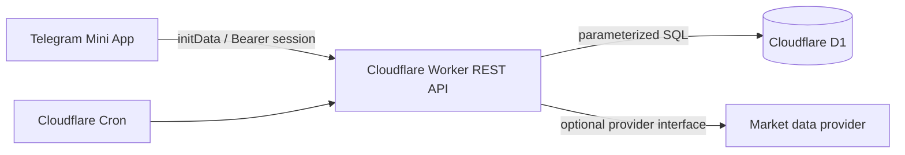
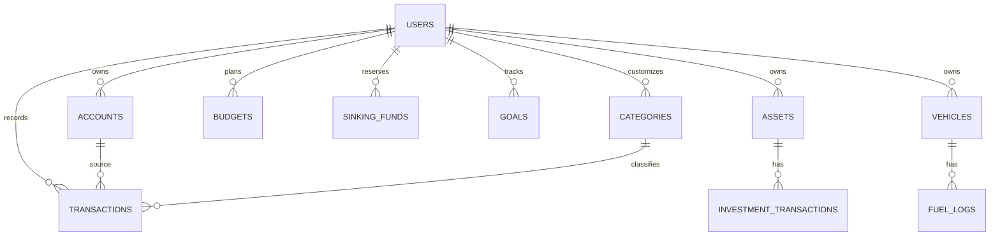

# เงินของฉัน — Telegram Mini App

A mobile-first personal-finance system for Telegram, built as one Cloudflare Worker backed by D1. Money is stored as integer satang; no financial calculation relies on JavaScript decimal values.

The tracker starts with a fresh D1 dataset for each Telegram user; it does not import or copy any Supabase data. New users start with zero account balance and the dashboard uses the current month's income minus expenses as the monthly starting amount. The UI keeps the original tracker's workflow (quick income/expense entry, multiple user-managed accounts, filters, custom categories, monthly/yearly reports and charts) while using the Worker/D1 API. White mode is the default with a soft blue-gray/pastel card layout; a comfortable dark mode can be toggled from Settings and is stored only in the browser.

## Architecture

The browser never receives the bot token or a user ID it can select. The Worker verifies the Telegram `initData` HMAC, checks `auth_date`, resolves the user from Telegram ID, and issues a signed one-day session. Every data query scopes to that session's `user_id`.

## Data model

Tables are created in `migrations/`: users, accounts, categories, transactions, budgets, recurring_transactions, sinking_funds, goals, assets, investment_transactions, portfolio_targets, vehicles, fuel_logs, net_worth_snapshots, and audit_logs. The migration includes foreign keys, user/date/account/category indexes, ownership constraints, and idempotency for generated recurring transactions.

## API

All responses use `{ success, data }` or `{ success:false, error:{code,message} }`.

| Route | Purpose |
|---|---|
| `POST /api/auth/telegram` | Verify Telegram initData; issue session |
| `GET /api/me` | Current user |
| `GET/POST/PATCH /api/accounts` | Account management, including add, rename, and archive |
| `GET/POST/DELETE /api/transactions` | Paginated transaction ledger and mutations |
| `GET/POST /api/budgets` | Monthly budget/actuals |
| `GET/POST /api/sinking-funds` | Reserved future obligations |
| `GET /api/dashboard` | Available money, summary and health values |
| `GET /api/goals` | Goals |
| `GET /api/net-worth` | Net-worth engine |
| `GET /api/portfolio` | Positions and allocation |
| `GET /api/reports/monthly?month=YYYY-MM` | Monthly summary, category breakdown, six-month trend |
| `GET /api/reports/yearly?year=YYYY` | Annual summary and monthly trend |
| `GET /api/forecast?months=3` | Explicitly labelled cash forecast |

`POST /api/transactions` supports income, expense, transfer, investment buy/sell, dividend, interest, refund and adjustment. Transfers debit one account and credit the other, and are never consumption expense. Deletes reverse account effects. Investment buys reduce cash but are not consumption expenses.

## Financial logic

- **Available money** = liquid assets − reserved funds − upcoming obligations − unpaid expenses.
- **Savings rate** = (income − consumption expenses) / income.
- **Emergency coverage** = savings / essential monthly budget.
- **Net worth** = assets − liabilities. Liability storage is intentionally ready for a follow-up migration; current response is explicit that no liabilities have been entered.
- Weekly food reporting derives each week's spend from real transaction dates. Budget stays monthly (฿2,800); a fifth week does not create a phantom fifth allocation.
- Portfolio valuation uses a manual price stored on each asset until a `MarketDataProvider` is configured. This avoids hard-coded live prices.

## Run locally

1. Install Node 22+ and run `npm install`.
2. Copy `.env.example` to `.dev.vars`; set `TELEGRAM_BOT_TOKEN`, `SESSION_SECRET`, and `APP_ORIGIN` there.
3. Create local D1 schema: `npm run db:migrate:local`.
4. Start API: `npm run dev:worker`; start UI in another terminal: `npm run dev`.
5. Run `npm run check`, `npm test`, and `npm run build`.

The local UI intentionally will not bypass Telegram authentication: open it through a configured Telegram test Mini App to establish a real session.

## Deploy

1. Create a Telegram bot with BotFather, create/set its Mini App URL and menu button; keep its bot token secret.
2. Authenticate Wrangler: `npx wrangler login`.
3. Create D1: `npx wrangler d1 create finance-db`, then replace `database_id` in `wrangler.toml`.
4. Set Worker secrets: `npx wrangler secret put TELEGRAM_BOT_TOKEN` and `npx wrangler secret put SESSION_SECRET`.
5. Set `APP_ORIGIN` for the deployed frontend using `wrangler secret put` or environment vars.
6. Apply schema: `npm run db:migrate:remote`.
7. Build frontend (`npm run build`) and deploy it to Cloudflare Pages or Workers static assets; update `APP_ORIGIN` and Telegram Mini App URL to its HTTPS URL.
8. Deploy Worker: `npm run deploy`.

For Cloudflare Pages Git integration, connect the GitHub repository `getan-cmyk/Planfinance`, use `main` as the production branch, `npm run build` as the build command, and `dist` as the output directory. `VITE_API_BASE_URL` may be set to `https://finance-telegram-mini-app.getananan.workers.dev`; the app also has this production URL as a safe non-secret default.
9. In Telegram, open the Mini App, create a transaction, and confirm a second Telegram account cannot read it.

## Production checklist

- Replace the D1 placeholder ID; never commit `.dev.vars`.
- Configure production `APP_ORIGIN` and Worker secrets.
- Enable Cloudflare rate limiting/WAF for `/api/auth/telegram`.
- Back up D1 before applying migrations. Migrations are additive and never perform destructive automated data changes.
- Confirm cron runs, idempotency, user isolation, invalid-initData rejection and session expiry in staging.
- Configure a real market-data provider only after obtaining its credentials; manual asset pricing remains available without one.
